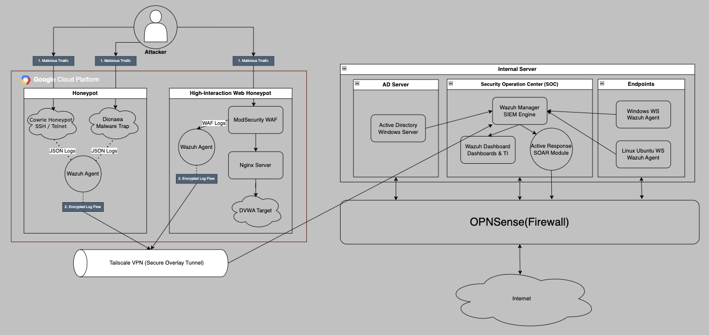

# 🛡️ Enterprise-Grade Virtual Security Architecture & SecOps Pipeline
> **Status**: 🚧 Work In Progress (현재 진행 중)  
> **Goal**: 온프레미스와 클라우드 환경을 아우르는 하이브리드 보안 아키텍처 설계 및 중앙 집중형 SIEM 기반의 실시간 위협 탐지/대응(Active Response) 자동화 파이프라인 구축

## 📝 Project Overview
본 프로젝트는 기업 환경과 유사한 가상의 IT 인프라를 클라우드 및 온프레미스(가상화) 환경에 구축하고, 이를 보호하기 위한 **이기종 보안 솔루션(SIEM, WAF, Honeypot, Firewall 등)을 통합 연동하는 SecOps 프로젝트**입니다. 
단순한 솔루션 설치를 넘어, **로그 정규화, 탐지 시나리오(Sigma, Custom XML) 개발, 그리고 능동 대응(Active Response) 자동화**에 초점을 맞추고 있습니다.

## 🏗️ Architecture Design
본 프로젝트는 하이브리드 환경에서의 통합 보안 관제 시스템을 목표로 설계되었습니다.

1. **Security Operations Center (SOC)**: 중앙 집중형 로깅 및 모니터링 (Wazuh, ELK Stack)
2. **Deception Zone (Cloud)**: 위협 행위자 유인 및 공격 기법(TTPs) 수집 (Cowrie, Dionaea)
3. **Perimeter Security (Hybrid)**: 외부 위협 1차 차단 및 네트워크 경계 보호 (WAF, Firewall, VPN)
4. **Internal Network (On-Premises)**: 사용자 작업 환경 (Ubuntu/Windows Endpoints with Wazuh Agent)
5. **Identity Management**: 중앙 계정 및 정책 관리 (Active Directory)

---

## 🚀 Progress & Task Tracker (진행 상황)

### 1. Security Operations Center (SOC)
- [x] **Wazuh Manager 구축**: SIEM 및 HIDS 중앙 관제 서버 구성
- [x] **ELK Stack 연동**: 위협 인텔리전스 및 로그 시각화를 위한 데이터 파이프라인 구축
- [ ] OCSF(Open Cybersecurity Schema Framework) 기반 로그 정규화 (Planned)

### 2. Perimeter Security (경계 보안)
- [x] **WAF 구축 및 연동**: Nginx + ModSecurity 환경 구축 및 OWASP CRS 적용
- [x] **웹 취약점 방어 테스트**: DVWA를 활용한 SQLi, XSS, RCE, LFI 공격 시뮬레이션 및 `403 Forbidden` 차단 검증
- [x] **Tailscale 기반 하이브리드 관리망 구축**: 
    - Tailscale VPN을 활용하여 GCP 클라우드 VM과 온프레미스 SOC 서버 간의 전용 관리 네트워크 구성
    - 외부 노출 없이 사설 IP 대역을 통한 보안 로그(Wazuh Agent-Manager) 전송 및 SSH 관리 환경 확보
- [ ] OPNSense 기반 방화벽 및 라우팅 구성

### 3. Deception Zone (허니팟 및 위협 수집)
- [x] **Cowrie (SSH) 허니팟 구축**: 무차별 대입 공격 및 악성 명령어 수집 환경 구성
- [x] Dionaea (Malware) 허니팟 추가 구축 및 악성코드 샘플 수집 체계 마련
- [x] **Sigma 룰 개발**: 허니팟에서 수집된 실제 공격 로그를 바탕으로 SIEM에 적용 가능한 Sigma 탐지 룰셋 작성

### 4. Internal Network & IAM
- [x] **Wazuh Agent 배포**: 웹 서버 및 엔드포인트 자산에 에이전트 설치 및 암호화 통신 구성
- [ ] Active Directory (Windows Server) 구축 및 계정/권한 통제 (Planned)
- [ ] 윈도우 엔드포인트 이벤트(Sysmon) 수집 및 모니터링 적용 (Planned)

---

## 🛠️ Key Engineering & Troubleshooting (핵심 엔지니어링 및 트러블슈팅)

### 💡 Issue 1: 이기종 다중 배열(Array) JSON 로그의 정밀 파싱 한계 극복
* **Background**: ModSecurity(WAF)에서 발생한 위협 로그가 Wazuh SIEM으로 인입될 때, `messages` 필드가 복잡한 다중 배열 형태로 구성되어 기존 `<field>` 태그 방식으로는 특정 공격(SQLi, RCE 등) 키워드 매칭에 실패하는 문제 발생.
* **Troubleshooting**: 
  * Wazuh의 JSON 디코더가 배열을 동적 인덱싱(`messages.1.message`)하는 구조적 특성을 파악.
  * 기존 구조적 매칭 대신 `<match>` 및 정규표현식(`<pcre2>`) 태그를 활용하여 **원문 로그(Full Log) 베이스의 스캐닝 방식으로 파서(Parser) 로직 전면 수정**.
* **Result**: SQLi, XSS, OS Command Injection 등 치명적인 웹 공격만을 특정(Level 12 이상)하여 분리해내는 맞춤형 SIEM 탐지 룰 구현 성공.

### 💡 Issue 2: 위협 탐지 기반 능동 대응(Active Response) 자동화 체계 마련
* **Background**: WAF가 공격을 차단(`403`)하더라도 공격자는 계속해서 다른 취약점을 스캐닝하는 상황 발생. 탐지 시 수동으로 방화벽을 차단하는 것은 SecOps 관점에서 비효율적.
* **Implementation**: 
  * Wazuh Manager에서 특정 고위험 룰(예: Rule ID 100201 - SQL Injection)이 발동될 경우 트리거되는 Active Response 정책 수립.
  * 에이전트가 설치된 웹 서버의 `iptables` 네트워크 방화벽을 자동으로 제어하여, **위협 식별 즉시 해당 공격자 IP를 600초간 완전 격리(Drop)**하는 자동화 파이프라인 완성.

---

## ⚙️ Tech Stack
* **SIEM / Log Analytics**: Wazuh, Elasticsearch, Logstash, Kibana (ELK)
* **Security Solutions**: ModSecurity (WAF), OPNSense (FW), Cowrie (Honeypot), Dionaea (Honeypot)
* **Infrastructure / Network**: GCP (Cloud VM), Tailscale (VPN), Nginx
* **OS**: Linux (Ubuntu), Windows Server (windows)
* **Rule Engineering**: Sigma, XML, Regular Expressions (PCRE2)
